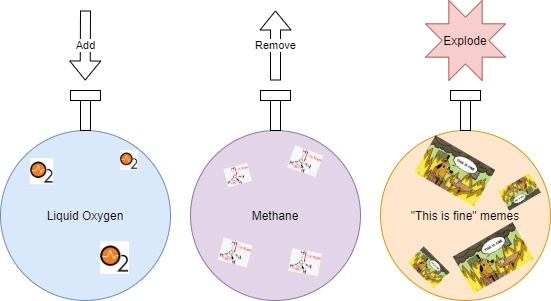

# NUnit

## Installation & Setup
###  Visual Studio
- Nuget package - NUnit3TestAdapter
### Resharper /  Rider
- Works out of the box

## Concepts
- Unit test structure
    - Arrange Act Assert AAA
    - Naming Given When Then
- Unit test writing technique
    - Red Green Refactor

## Assertions
### Model
- Classic
    - TODO Example
    - Pros 
        - Vague assertion messages
        - Easy/Obvious usage
    - Cons
        - 

- Constraint
    - TODO Example
    - Pros
        - Much clearer assertion messages
        - More powerful
    - Cons
        - Less obvious usage than classic model
        
## Domain

## Code